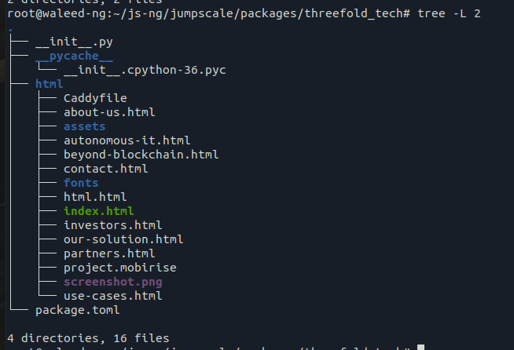
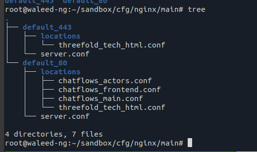
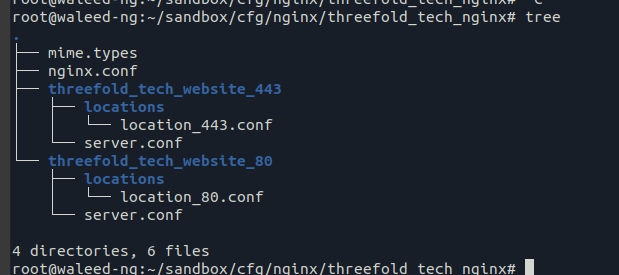
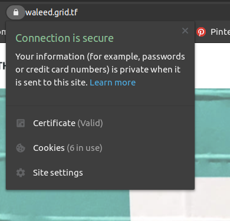

# Deploy website and packages on jsng

## Index

- [Requirments](#requirments)
- [create package using jsng](#creating-jsng-package)
- [create website with custom locations](#create-website-with-custom-locations)

## Requirments

- [JS-NG](https://threefoldtech.github.io/js-ng/wiki/#/./installation)
- Redis (Install using: `apt install redis`)
- Nginx (Install using: `apt install nginx`)
- Certbot [Install](https://certbot.eff.org/lets-encrypt/ubuntuxenial-nginx.html)
- DO Machine and domain
- A test package [here](https://github.com/threefoldtech/www_threefold.tech)

## Creating jsng package

- Upgrade the package to jsng, modify package.toml to be the following

  ```toml
  name = "threefold_tech" # package name
  ports = [ 80, 443] # package ports
  [[static_dirs]]
  name = "html" # static location name
  path_url = "threefold_tech" # access location path localhost/threefold_tech
  path_location = "html" # served files location
  index = "index.html" # index location
  ```

- Example package structure

  

- Get nginx and threebot server instances

  ```python
  nginx = j.sals.nginx.get("main")
  nginx.configure()
  nginx.save()
  server = j.servers.threebot.get("threefold_tech")
  server.packages.add("/root/js-ng/jumpscale/packages/threefold_tech")
  server.save()
  server.start()
  ```

- Locations should be like the following

  

- start nginx

  ```bash
  nginx -c ~/sandbox/cfg/nginx/main/nginx.conf
  ```

- Make sure by: `curl http://localhost/threefold_tech/threefold_tech`

## Create website with custom locations

- Get nginx sal instance

  ```python
  nginx = j.sals.nginx.get("threefold_tech_nginx")
  nginx.configure()
  nginx.save()
  ```

- create 443 website

  ```python
  website = nginx.websites.get("threefold_tech_website_443")
  website.port = 443
  website.ssl = True
  website.domain = "waleed.grid.tf"
  website.letsencryptemail =  "waleed.hammam@gmail.com"
  ```

- create 443 location

  ```python
  loc = website.locations.get("location_443")
  loc.path_url = "/" #  location path
  loc.path_location = "/root/js-ng/jumpscale/packages/threefold_tech/html/" #  alias for the location
  loc.index = "index.html"#  index of the location
  loc.location_type = "static" # static,spa,proxy type of   location config
  loc.scheme = "https" #  https or https
  website.configure()
  ```

- create 80 website

  ```python
  website = nginx.websites.get("threefold_tech_website_80")
  website.port=80
  website.domain = "waleed.grid.tf"
  ```

- create 80 location

  ```python
  loc = website.locations.get("location_80")
  loc.path_url = "/" #  location path
  loc.path_location = "/root/js-ng/jumpscale/packages/threefold_tech/html/" #  alias for the location
  loc.index = "index.html"#  index of the location
  loc.location_type = "static" # static,spa,proxy type of   location config
  loc.scheme = "http" #  https or https
  ```

- Configure website and locations

  ```python
  website.configure()
  ```

- start nginx

  ```bash
  nginx -c ~/sandbox/cfg/nginx/threefold_tech_nginx/nginx.conf
  ```

- Locations should be like the following

  

- visit your domain to make sure you are ok and with https certificate

  

### Troubleshooting

- if you got 403 forbidden error this is due to permissions, make sure you using nginx with the correct user in nginx.conf file first line
